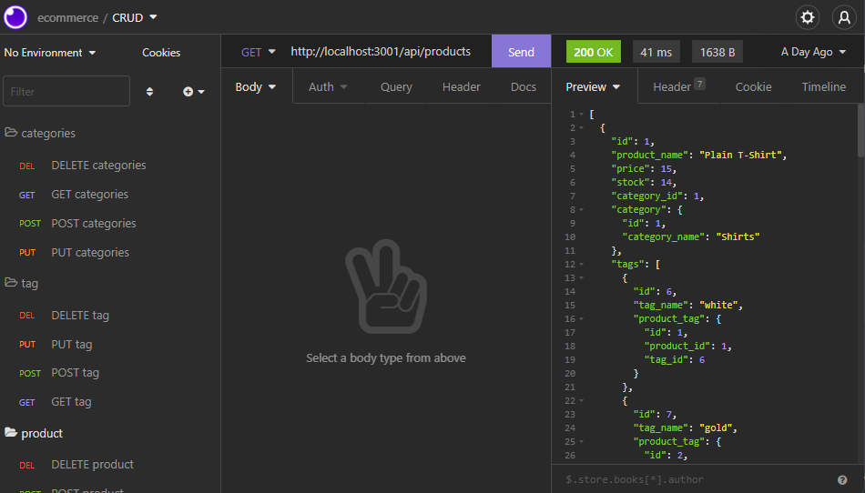

### Description

The project is a sample back-end for an e-commerce site that uses a MySQL DB along with Sequelize as the Object Relational Mapper. Essentially, once paired with express.js and REST API endpoints, the user has the ability to perform Create, Read, Update, and Delete (CRUD) operations which will reflect within the MySQL DB. The project is set-up in a way to scale for increased complexity as the site builds in complexity.

### Usage
While the project does not have a front-end attached, the user can simulate and test the CRUD functionality by using an API endpoint tester like Insomnia. Here, the user can perform various operations for the existing database tables: 

    1) Cateogry: inventory category
    2) Product: actual product
    3) Tag: color/type

The endpoints and their functionality can be found within the individual api route files **'routes/api/*enter type*'**

#### DB Connection
Once the repo is copied to a local directory, the user will need to ensure MySQL and a .env file containing database connection variables per the config/connection.js file are calibrated accordingly. Once connected, the user can run the following to create and seed the database.

Within MySQL

    SOURCE db/schema.sql

Within the project root directory

    npm run seed

The seed script will call the variuos seed.js files. For more info please see package.json 
    